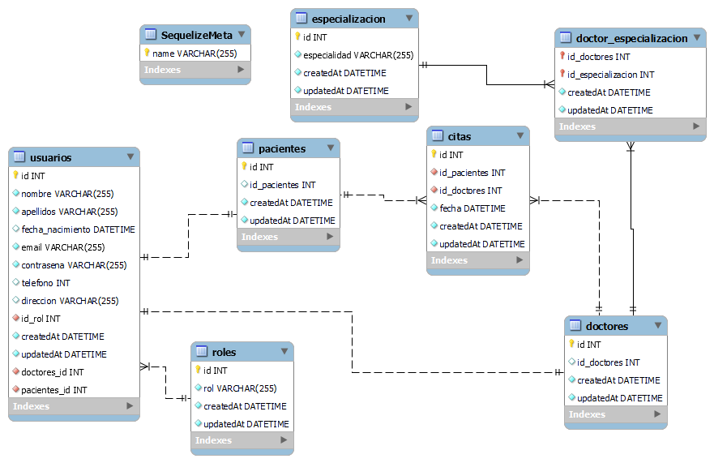

# Aplicación Backend para gestión de una clinica dental

<details>
  <summary>Contenido 📝</summary>
  <ol>
    <li><a href="#objetivo">Objetivo</a></li>
    <li><a href="#sobre-el-proyecto">Sobre el proyecto</a></li>
    <li><a href="#deploy-🚀">Deploy</a></li>
    <li><a href="#stack">Stack</a></li>
    <li><a href="#diagrama-bd">Diagrama</a></li>
    <li><a href="#instalación-en-local">Instalación</a></li>
    <li><a href="#endpoints">Endpoints</a></li>
    <li><a href="#contacto">Contacto</a></li>
  </ol>
</details>

## Objetivo

Este proyecto requería una API funcional conectada a una base de datos con al menos una relación de uno a muchos y una relación de muchos a muchos.

## Sobre el proyecto

Aplicación de ejemplo para la gestión de una base de datos de una clínica dental. La gestión se realiza teniendo en cuenta los distintos tipos de roles (admin, user) y la autenticación basada en token.

## Deploy 🚀 

<div align="center">
    <a href="https://github.com/ZackFer90/clinicaDental"><strong>Url a producción </strong></a>🚀🚀🚀
</div>

## Stack

Tecnologías utilizadas:

<div align="center">
<a href="https://sequelize.org/">
    
</a>
<a href="https://www.expressjs.com/">
    
</a>
<a href="https://nodejs.org/es/">
    
</a>
<a href="https://developer.mozilla.org/es/docs/Web/JavaScript">
    
</a>
 </div>

## Diagrama BD



## Instalación en local

1. Clonar el repositorio
2. `$ npm install`
3. `$ npm i nodemon -d`
4. Conectamos nuestro repositorio con la base de datos
5. `$ Ejecutamos las migraciones`
6. `$ Ejecutamos los seeders`
7. `$ npm run dev`

## Endpoints

<details>
<summary>Endpoints</summary>

- AUTH

  - Registrar alumno

          POST http://localhost:3000/auth/register

    body:

    ```js
        {
          "nombre": "Silvia",
          "apellidos": "Gutierrez",
          "email": "silvia@gmail.com",
          "contrasena": "123456",
          "fecha_nacimiento": "1985-07-26"
        }
    ```

  - Login

          POST http://localhost:3000/auth/login

    body:

    ```js
        {
          "email": "silvia@gmail.com",
          "contrasena": "123456"
        }
    ```

- USERS

  - Obtener todos los usuarios

          GET http://localhost:3000/users?page=2

## Contacto

<a href="https://www.linkedin.com/" target="_blank"></a>
